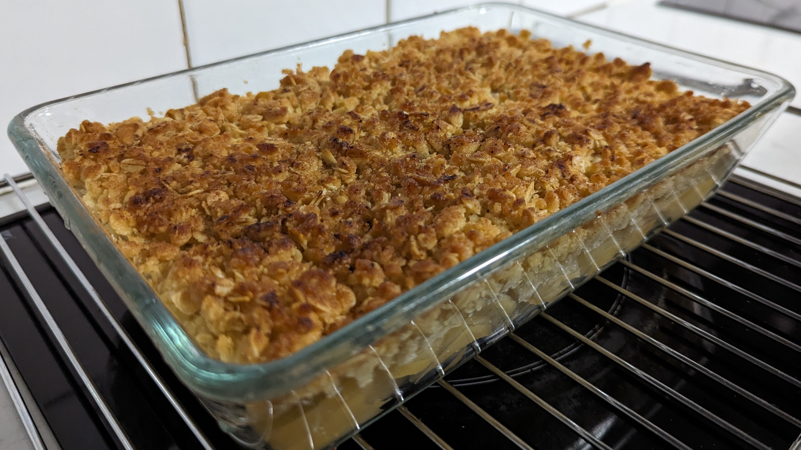
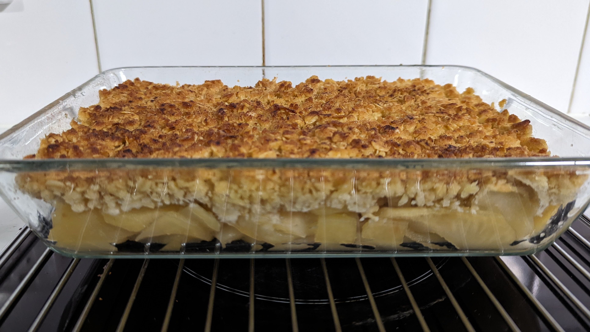

# Apple Crumble

## Ingredients

### Filling

- 3 medium apples, peeled, cored, and sliced (about 2mm or so thick)
- ¼ cup water
- 1 tbsp lemon juice
- 1 tbsp brown sugar
- [optional] ¼ tsp ground cinnamon

### Crumble

- ⅓ cup plain flour
- ⅓ cup brown sugar
- ⅓ cup rolled oats
- 60g butter, chopped
- [optional] ¼ tsp ground cinnamon
- [optional] ¼ tsp ground nutmeg

## Method

> 1. Preheat oven to 180°C/160°C fan forced. Combine apples, juice, sugar, cinnamon, and water in small saucepan over medium heat. Cook, stirring for 5 minutes or until apple is slightly softened. Leave in the pan to soak/soften.
> 1. To make the crumble, combine the flour, sugar, oats, cinnamon, nutmeg, and butter in a bowl. Use your fingertips to rub the butter into the flour mixture until the mixture resembles breadcrumbs. 
> 1. Transfer the apples into a 3 cup capacity ovenproof dish, draining off most of the liquid. Sprinkle crumble mixture over the apples.  Bake in oven for 25-30 minutes or until golden brown.
> 1. Serve warm with custard, icecream or whipped cream.

## Tips

> - Soften the butter for a few seconds in the microwave if it's too solid to squish between fingertips reasonably easily.  It should remain solid and not at all runny for the crumble.
> - Using brown sugar will give the dish a slightly rich, carameled taste and colour, but caster sugar can be easily swapped in for a lovely variation!

     