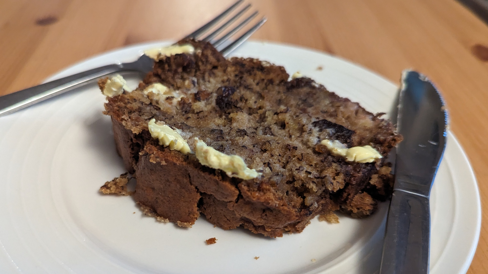

 

# Banana Bread

## Ingredients

- 1½ cups (225g) plain flour
- 1 tsp baking powder
- 1 tsp ground cinnamon
- ½ cup (110g) caster sugar
- 1 egg
- ⅓ cup (80ml) sunflower oil
- 1 tsp vanilla extract
- 4 ripe bananas, mashed
- 65g pecan nuts, roughly chopped
- Butter and/or honey to serve

## Method

> 1. Preheat oven to 180°C (fan forced). Grease and line the base of a 900ml loaf pan.
> 2. Sift the flour, baking powder, cinnamon, and sugar with 1 tsp of salt into a large bowl. In a separate bowl, combine the eggs, oil and vanilla.
> 3. Add to the dry ingredients with banana and pecans, and fold until _just_ combined - do not overmix.
> 4. Place into the loaf pan and bake for 50 minutes or until golden brown. Allow to cool for 10 minutes, then remove and slice thickly. Serve spread with butter and/or drizzled with honey.

## Tips

> - Seemed to require up to 15 minutes extra in the oven for the centre to firm up.

     