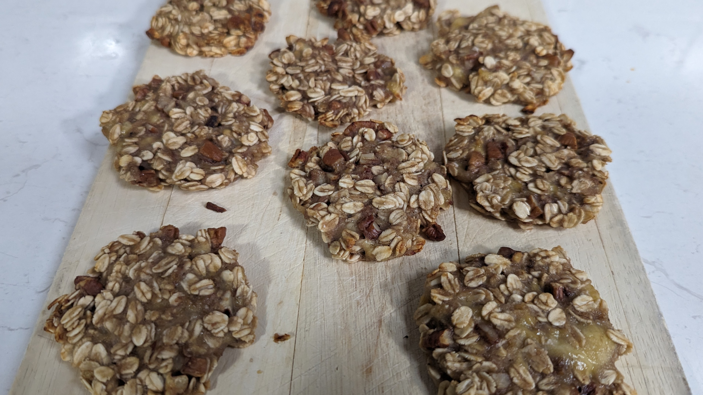

 

# Banana Oat Cookies

## Ingredients

- 2 ripe bananas
- 1 cup rolled oats (or toasted muesli for a more interesting, slightly crunchy version)
- ⅓ cup walnuts or pecans

## Optional Ingredients

- 2 tsp instant coffee granules (banoffee version)
- ½ tsp cinnamon
- ⅓ cup dark choc chips
- ¼ cup raisins
- Peanut butter (to serve)

## Method

> 1. Preheat oven to 180°C (fan forced). Line a baking tray with baking paper. Mash the bananas in a bowl with a fork.
> 2. Add the oats, chopped nuts and any optional addins.
> 3. Mix together well with a fork or wooden spoon.
> 4. Using a tablespoon, take some of the mixture and roll it into a ball. Place it onto the lined baking tray, and flatten with your hand to make a cookie.
> 5. Place the baking tray in the oven and bake for 10 minutes. Flip cookies and bake 2-3 more minutes, to solidify the undersides of the cookies. Transfer cookies onto a wooden board to cool.

## Tips

> - Plop a dollop of peanut butter on top before baking for a bit of spice.
> - Add 2 tsp coffee granules to the mix before shaping for a banoffee version.
> - Swap out the rolled oats for a toasted muesli (with or without fruits and nuts included) for a slightly fancier spin on the recipe.
> - Drizzle melted chocolate on top, or dip cookies into a bowl of melted dark chocolate after cooking for a chocolatey version.

           