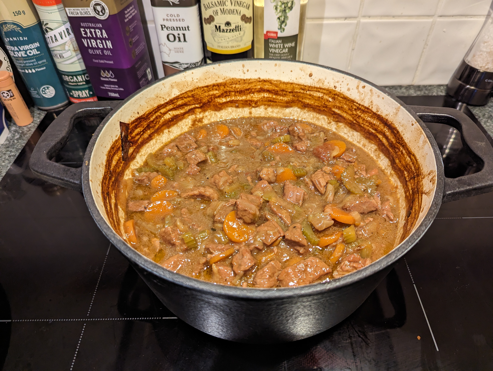
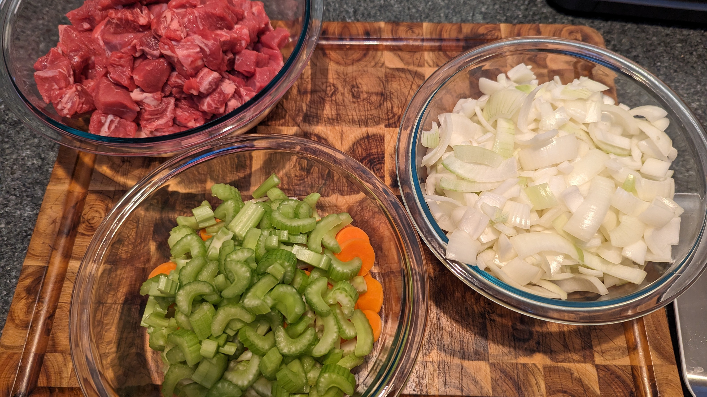
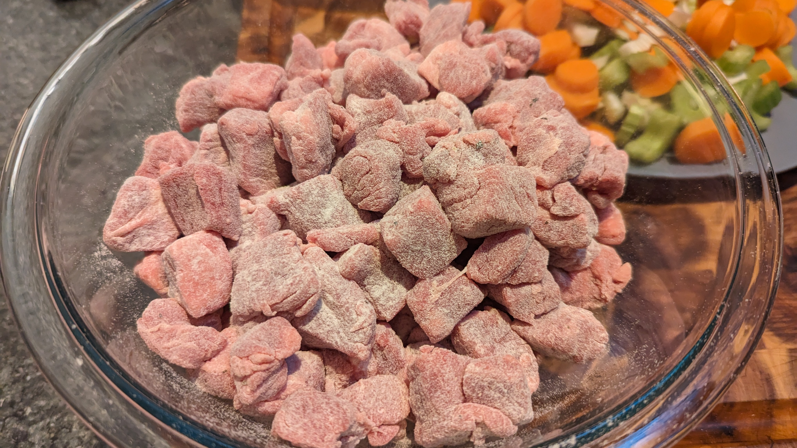
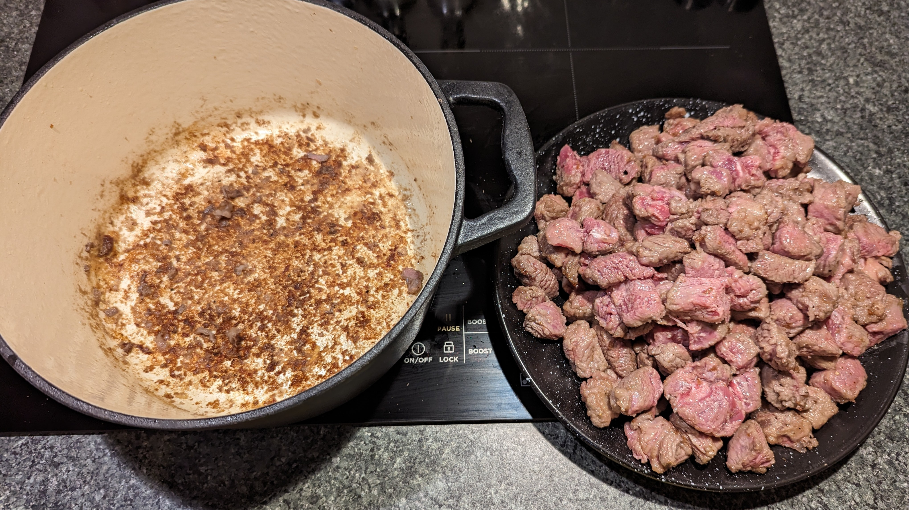
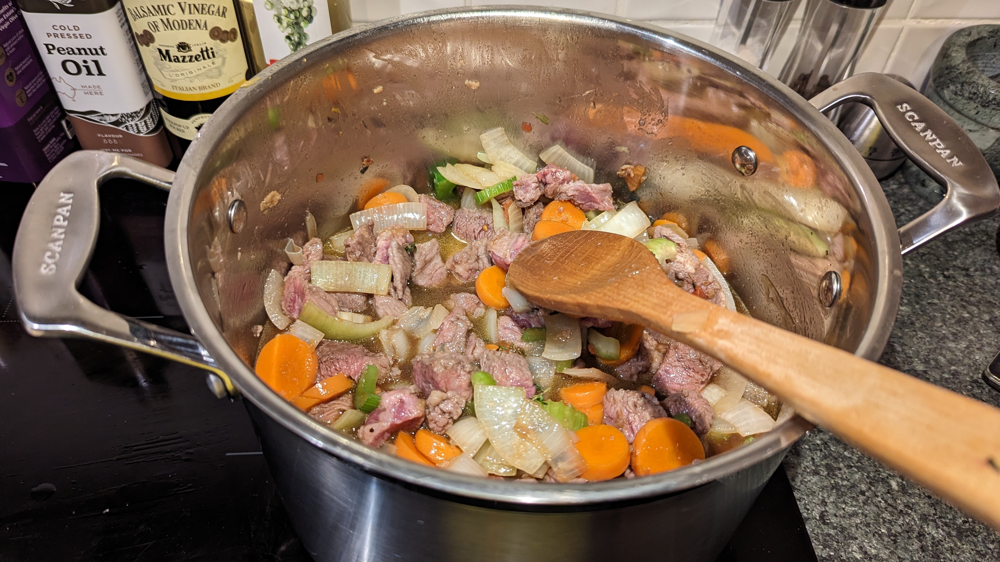
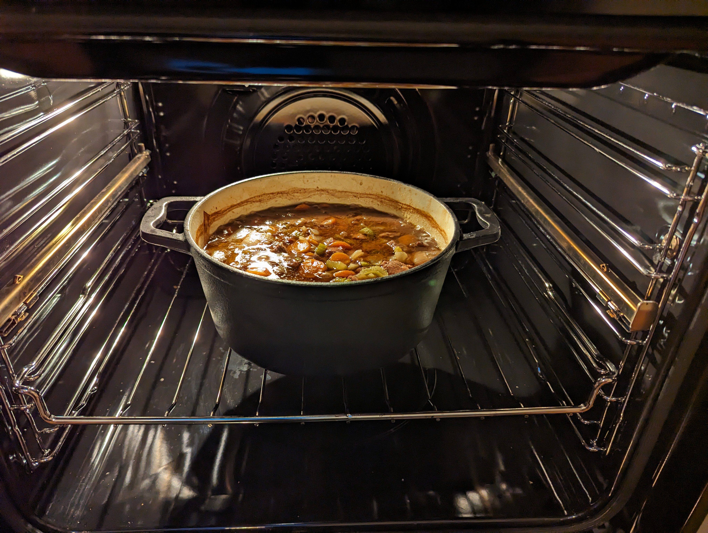
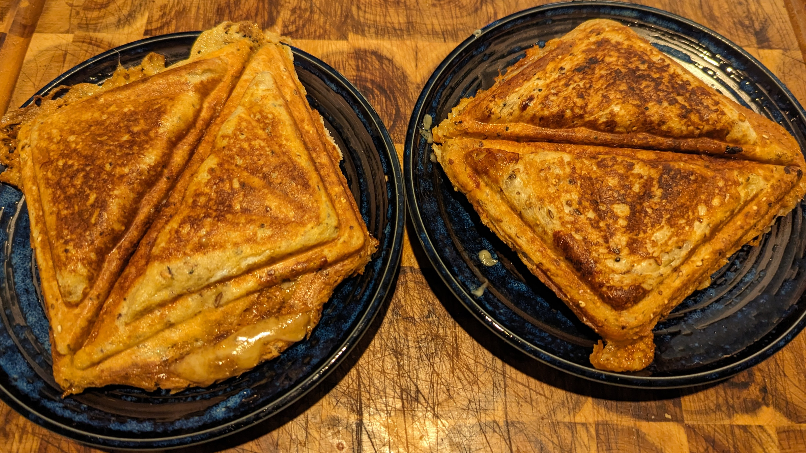

# Beef & Guinness Casserole

*Created: 25th of June 2023 &middot; Last updated: 29th of September 2026*

## Ingredients

- 1.5kg stew beef, trimmed and cut into around 4 cm pieces
- 2 tbsp plain white flour, seasoned with sea salt and cracked black pepper
- 1 tbsp olive or vegetable oil
- 4 tbsp butter
- 500ml good quality beef stock
- 1 tbsp tomato puree
- 4 large onions, peeled and sliced coarsely 
- 225g carrots, peeled and sliced
- 225g celery, roughly chopped
- 500ml Guinness (I used extra stout, not draught). Any stout should do
- 5 thyme sprigs
- A few sprigs of flat leaf parsley or a small bay leaf, to garnish
- Sea salt and cracked black pepper

## Method

### 1. Prepare the beef 

> Preheat the oven to fan 170°C. Toss the beef in the seasoned flour to coat, shaking off any excess. In a large casserole dish, heat the oil and melt 3 tablespoons of the butter over a high heat. Add the beef to the pan and quickly brown in batches.
> Be careful not to crowd the pan as the beef will stew instead of sear and caramelize. Remove the seared beef to a plate. Reduce the heat to low and add 100ml of the beef stock to deglaze, scraping the residue off the base to save the caramelized flavor. Stir in the tomato puree and then turn the heat off.
 
### 2. Saute the onions 

> In a frying pan, melt the remaining butter over a medium heat. Add the onions and saute for 10 minutes or until softened. Tip the onions out of the pan and set aside. To the same pan, add the carrots and celery and sauté for 5 minutes, stirring occasionally. Deglaze this pan with a little of the stock and add to the casserole.
 
### 3. Combine and braise 
 
> Add the meat, onions, carrots and celery to the casserole dish with the Guinness and remaining stock. Add the thyme sprigs and stir all together to ensure everything is well distributed. Bring the casserole to the boil over a high heat, then cover and braise in the oven for 3 hours, checking periodically that it’s not drying out and adding more stock (or water) if necessary. Check the meat with a skewer or knife to see if it’s tender; it should be soft and easily come apart. Season to taste.
 
### 4. Optional 

> To thicken for use in other recipes later, reduce heat to 140°C and partially uncover lid. Cook a further 1 hour to reduce liquid, and make beef extra tender.
 

## Tips

### Leftover Casserole Uses

> - pies
> - pasties
> - shepherd's pie
> - savory rice
> - pasta bake
> - wraps
> - jaffles/toasties 
> - fajitas/enchiladas
> - sloppy joes
> - baked potatoes

**Serves:** 6-8

            