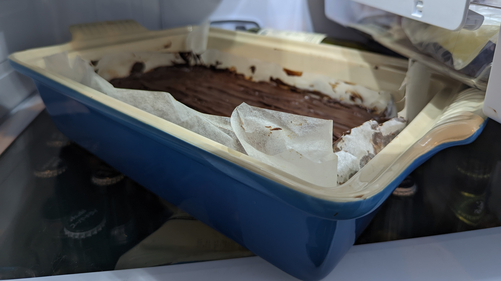

# Caramel Slice

## Ingredients

### Coconut Biscuit Base

- 1 cup (150g) plain (all-purpose) flour, sifted
- ½ cup (40g) desiccated coconut
- 125g unsalted butter, melted
- ½ cup (90g) brown sugar

### Caramel Filling

- 125g unsalted butter, chopped
- 2 x 395g cans sweetened condensed milk
- ⅓ cup (115g) golden syrup

### Chocolate Topping

- 200g dark chocolate, chopped
- 1 tbsp vegetable oil

## Method

> 1. Preheat oven to 180°C. Place the flour, coconut, butter and sugar in a bowl and mix to combine. Using the back of a spoon, press the mixture into the base of a lightly greased 20cm x 30cm tin lined with non-stick baking paper and bake for 15–20 minutes or until golden.
> 2. While the base is cooking, make the caramel filling.
> 2. Place the butter, condensed milk and golden syrup, in a medium saucepan over medium heat. Whisk until the butter is melted and cook, whisking frequently, for 5–7 minutes or until the mixture has thickened slightly (see tip). 
> 2. Pour the caramel over the cooked base, spread evenly with a palette knife and cook for 15–20 minutes or until golden. Cool slightly and refrigerate until cold
> 3. To make the chocolate topping, place the chocolate and oil in a heatproof bowl over a saucepan of simmering water, and stir until melted and smooth. Pour the chocolate over the caramel mixture and spread evenly. Refrigerate for 30 minutes, or until firm. Using a warm knife, cut into slices or squares to serve. Makes 20 squares

## Tip

> - When stirring the caramel, scrape the sides and bottom of the pan so the mixture doesn’t stick.
> - Try making the base from your favourite biscuits. Just take the equivalent weight of biscuits (around 280g), blend them coarsely in a blender, and combine with butter as per step 1.  Biscoff & Digestives are some examples that work well!

*Last updated 28 Jul 2022, 13:06:22*

       

This page has been viewed ... times.

