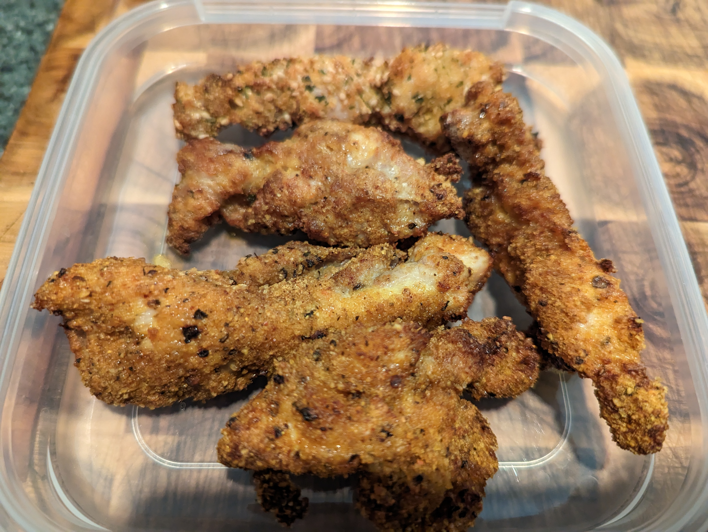

# Chicken Tenders

## Ingredients

### Breadcrumbs:

- cornflake crumbs
- pepper
- garlic salt
- paprika
- curry powder
- chilli powder
- mustard powder

### Batter:

- eggs
- ranch dressing

## Method
1. preheat airfryer to 180

2. cook 6 mins, flip, further 6 mins

*Last updated 1 Jun 2023, 20:11:43*

      
