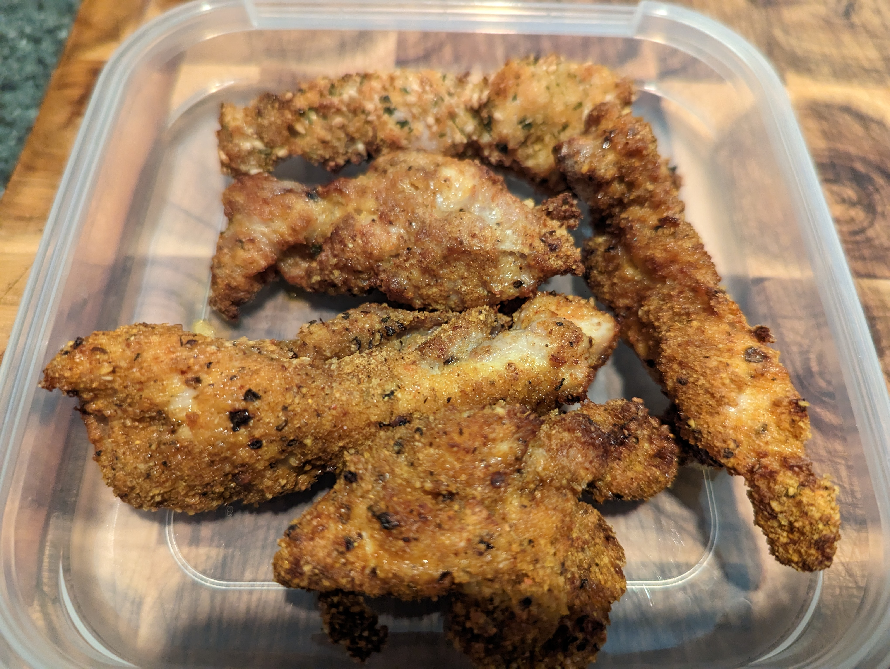

# Chicken Tenders

*Created: 25th of June 2023 &middot; Last updated: 29th of September 2026*

## Ingredients

### Chicken

- 500g thigh fillet chicken, sliced into strips, around 3cm thick

### Batter

- eggs
- ranch dressing

### Crumb coating

- cornflake crumbs
- pepper
- garlic salt
- paprika
- curry powder
- chilli powder
- mustard powder

## Method

> 1. Preheat airfryer to 180°C
> 1. Take your sliced chicken strips and place them all on a chopping board. Use a meat tenderiser to soften and increase their surface area (to pick up more flavouring)
> 1. Lightly beat together ranch dressing with eggs in a large bowl
> 1. In a second large bowl, stir together the dry ingredients and put it next to your batter bowl.
> 1. One at a time, take a chicken strip, dip it a couple of times in the egg batter, and hold it above the bowl for a couple of seconds, until it stops dripping. Lay it in the crumb bowl and lightly turn it until it is completely coated in crumbs and seasoning. Lay it out on a plate, not touching the other strips.
> 1. Repeat step 5 for the remaining strips.
> 1. Place your battered chicken into air fryer (in batches if you dont have space), keeping them as long and straight as you can manage. Bake for 12 minutes, turning once or twice

## Tips

> - These survive reheating *extremely* well, from both fridge and freezer, so consider making a larger batch and freezing your extras for a rainy winter's night
> - While battering and crumbing, try to keep one hand on "dry" and the other "wet" bowls and ingredients, you will prevent a lot of messy cleanup and clumpy seasoning. 
> - The seasoning is largely up to you, just be sure to include either breadcrumbs or cornflake crumbs, and some type of salt.
> - Discard the leftover seasoning as it will be a health hazard to eat.
> - Leftover batter can be cooked in the air fryer (around 7-8 minutes) in muffin pans for tasty mini omlettes.

**Serves:** 3-4

        