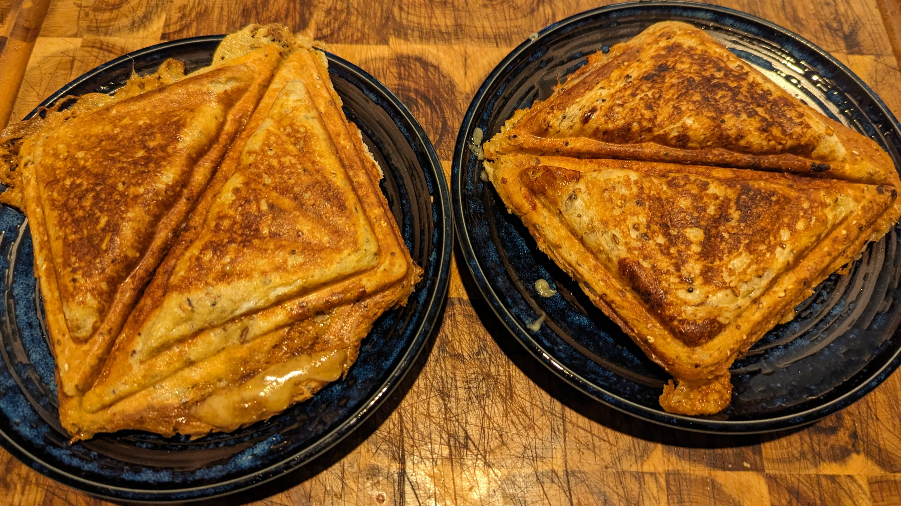
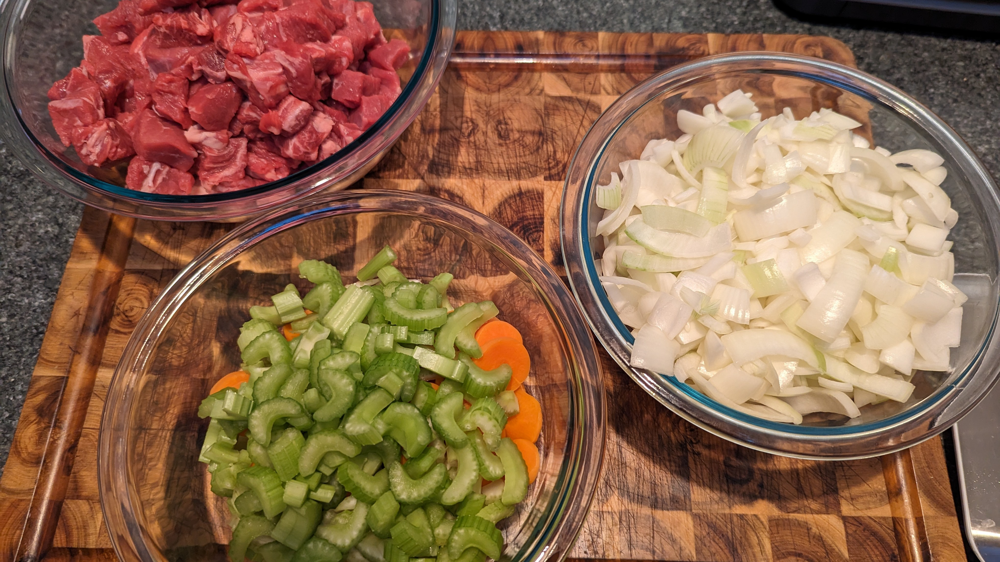
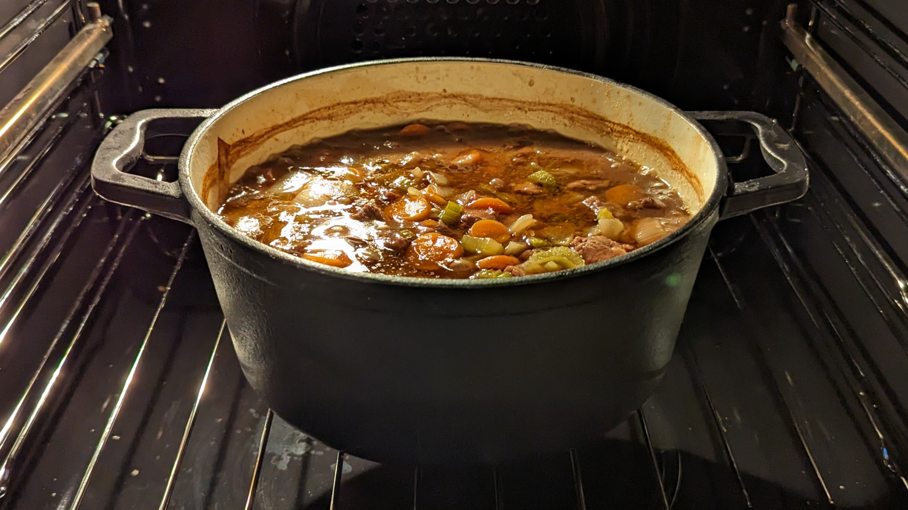

# Workflow Test Recipe 4 

## Ingredients:

- ingredient 1
- ingredient 2
- ingredient 3
- ingredient 4
 
## Method:

> step numero uno
> 
> step numero dos
> 
> step numero tres
 
## Tips:

> handy hint 1
> 
> handy hint 2

       