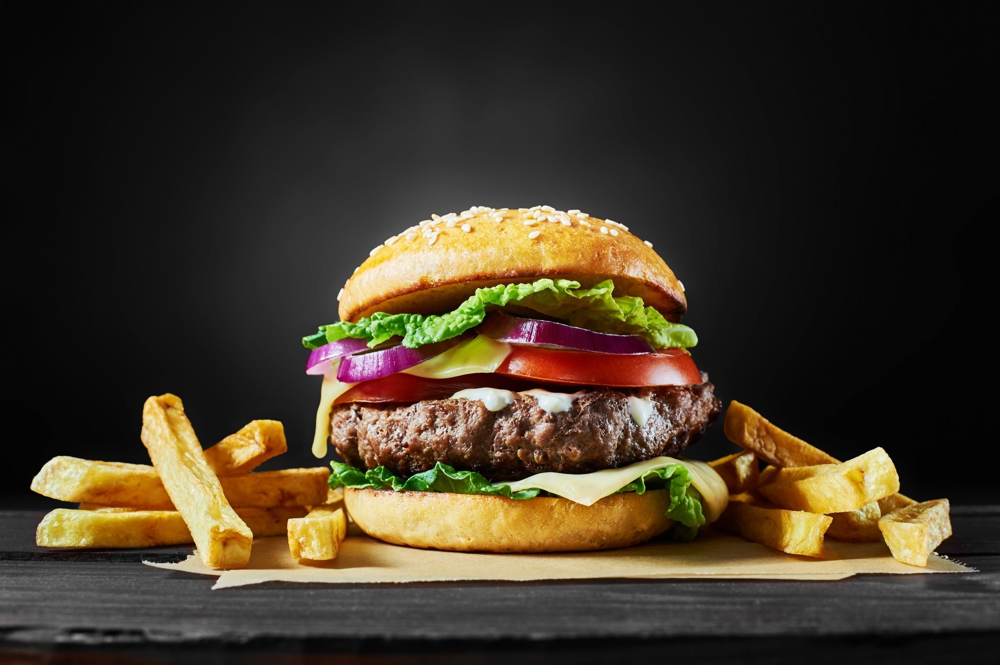

# [Template] Recipe Title

Put a short description of the recipe here.  Maybe add a photo or drawing.

# Ingredients

Ingredients can be divided into component parts, like sauce, filling, pastry, dough, etc.

## Ingredient component 1 (ie. Sauce)

-   1 cup ut orci quis augue placerat dapibus
-   2 to 3 pellentesque consectetur mauris quis tincidunt laoreet
-   1 tbsp. porttitor felis id ex hendrerit, nec euismod dui efficitur)
-   Fusce pulvinar quam ac mollis imperdiet
-   Sed non orci feugiat, porta nunc nec, aliquam massa
-   Maecenas dictum nisi

## Ingredient component 2 (ie. Pastry)

-   1kg Vivamus a orci non tortor ullamcorper
-   1 cup placerat dui dignissim
-   1 tsp. viverra porta
-   1 tsp. hendrerit tellus
-   1 tsp. ground cayenne pepper
-   3 quis mi ultricies
-   2 cups gravida
-   Nulla id risus congue, iaculis felis
-   1 tsp. lorem eu ultrices congue
-   Duis vitae ex porta elit mollis feugiat

# Method

This section can also be divided into steps.  Recipes are easier to follow if they separate complex tasks into smaller, simpler ones.  Can be a good idea to add photos for these steps to help illustrate the process.

You may wish to include things like oven preheating in this section before the other steps.
- Preheat fan-forced oven to 200C

## Step 1 (eg. preparation/dicing/sifting/braising)

Lorem ipsum dolor sit amet, consectetur adipiscing elit. Morbi aliquam, turpis vel tempor luctus, augue mauris pellentesque mauris, eget euismod odio dui non neque. Morbi eleifend lacus sit amet cursus pretium. Nulla quis erat eu leo malesuada viverra sit amet a odio. Sed sit amet finibus nisi.

Quisque pharetra, lectus non vehicula rhoncus, neque dui rutrum dolor, eget facilisis neque neque et nibh. Interdum et malesuada fames ac ante ipsum primis in faucibus. Lorem ipsum dolor sit amet, consectetur adipiscing elit. Sed feugiat vitae orci vel suscipit. Nunc ut velit metus. Proin eleifend lobortis nisi viverra efficitur. In neque tellus, malesuada quis imperdiet id, maximus at metus. Maecenas vitae velit quis purus pellentesque.

## Step 2 (eg. combining)

Quisque vestibulum blandit magna vitae feugiat. Maecenas elit neque, fermentum nec tristique ut, accumsan at lacus. Phasellus quis sapien eu arcu convallis venenatis. Integer dignissim nisl nec ipsum pharetra accumsan. Praesent id iaculis orci. Nulla gravida, quam in iaculis pharetra, tellus dolor ullamcorper ante, et posuere leo augue laoreet sapien. 

Mauris interdum ex ex, sit amet posuere metus iaculis a. Praesent viverra lectus massa, at pharetra tellus iaculis non. Mauris consequat dolor mollis est rutrum, vel congue orci imperdiet. Phasellus efficitur finibus nisi. Curabitur sodales metus augue, ut tempor dolor condimentum vitae. Mauris ultrices accumsan nisi gravida sollicitudin. Suspendisse quis.

## Step 3 (eg. baking/poaching/grilling/chilling)

Morbi finibus porttitor enim, mattis pellentesque quam. Cras eu velit vel quam varius suscipit vel vel quam. Nulla nec sapien aliquet, mollis lectus a, efficitur libero. Phasellus venenatis mi sed elit sagittis, viverra tempus tortor mollis.

Aenean sit amet egestas massa. 

Sed euismod urna vel metus fringilla dapibus. Vestibulum porta elit vitae ornare ornare. Maecenas mollis arcu quis magna faucibus, sit amet volutpat erat eleifend. Morbi eget justo nunc. Aenean suscipit fermentum pretium. Cras at egestas arcu. Nam tincidunt velit non eros fringilla tempus.

## Step 4 (eg. presenting/serving)

Suspendisse porttitor leo quis lorem ultricies laoreet. Fusce accumsan diam ex, sed imperdiet velit pretium et. Vestibulum ante ipsum primis in faucibus orci luctus et ultrices posuere cubilia curae; Donec diam turpis, finibus nec blandit scelerisque, pharetra et dui. Vestibulum ac blandit orci. Fusce sodales velit vel placerat rutrum. Integer nisi risus, elementum eget blandit non, scelerisque congue nisi. Sed in scelerisque dolor. Integer ut lacus pellentesque, iaculis sem nec, accumsan augue. Nulla malesuada libero ac ipsum vehicula placerat. Morbi iaculis nisl sodales consectetur mollis. Donec rhoncus, mauris sit amet condimentum porta.

# Tips

Feel free to include variations on your dish here, and other tips like how to store or reuse your leftovers in different ways.

## Variations

-   Curabitur vehicula mauris sit amet dignissim vestibulum.
-   Sed id leo fermentum, eleifend ex sit amet, venenatis orci.
-   Quisque convallis arcu sit amet tortor tempus, sed accumsan mi rutrum.

-   Duis sed dui scelerisque, vulputate sapien eu, tincidunt mauris.

## Leftovers storage

Nullam pellentesque in urna in hendrerit. Quisque lorem nunc, ultricies vel bibendum quis, consequat vitae nisl. Proin id eleifend quam.

## Things to try with your leftovers

-   Cras scelerisque elit non porttitor pharetra.
-   Mauris efficitur nunc sed purus interdum placerat.
-   Sed commodo mauris at eros dictum volutpat.
-   Praesent eu dui sed purus fermentum viverra eget vel mi.

# Afterthoughts

Did you think this was a good recipe? Did it take too long to prepare, did it taste good? Were there too many dishes to wash afterward? Would you make it again, or is there a better thing we should try?

*Last updated 15 Apr 2023, 23:37:57*

   